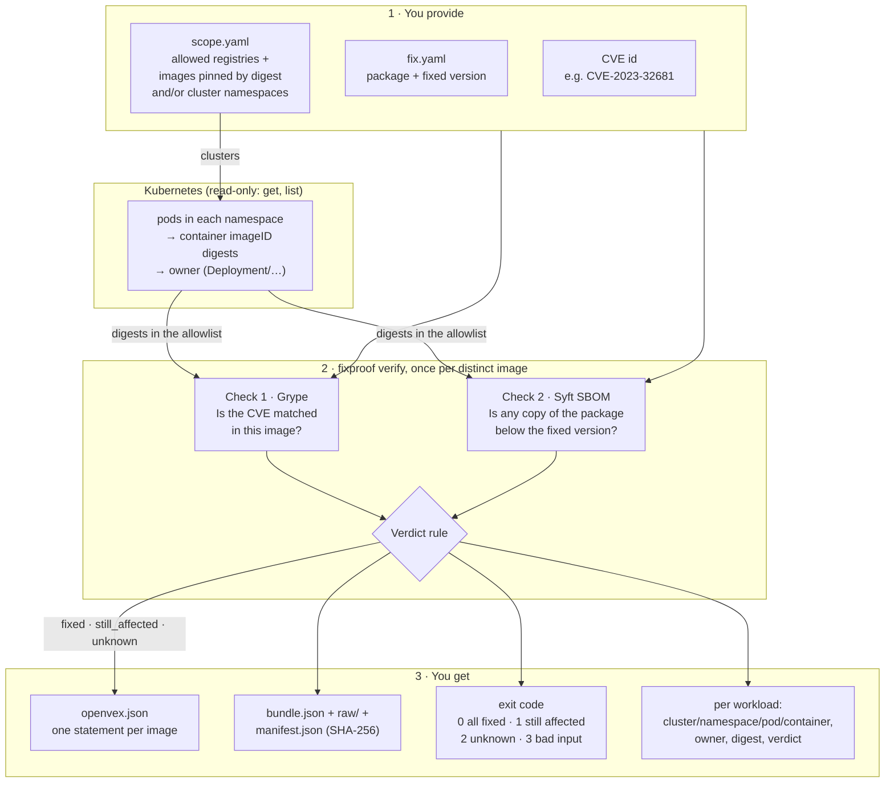
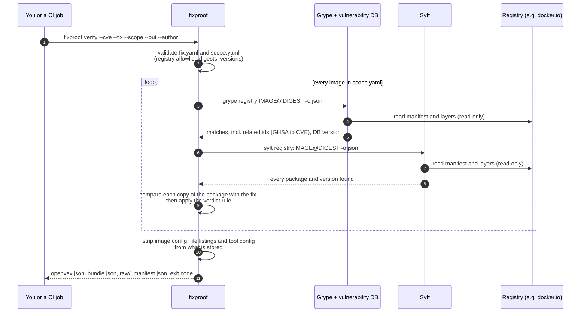
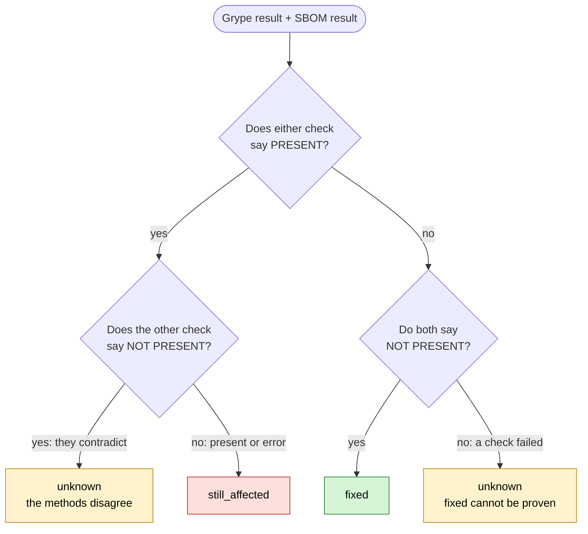
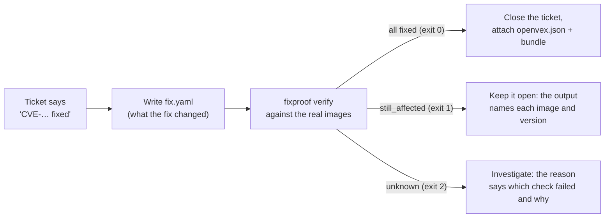

# fixproof

**Proof, image by image, that a remediated CVE is actually gone, not just that the ticket closed.**

[](https://github.com/Govardhan527/fixproof/actions/workflows/ci.yml)
[](https://github.com/Govardhan527/fixproof/actions/workflows/live.yml)

A ticket says "CVE fixed". fixproof checks that claim against the container images you actually
ship. For each image it answers one question: **is the vulnerable component still there?**

- `fixed`: two independent checks both say the vulnerable version is gone.
- `still_affected`: at least one check finds it, and nothing contradicts that.
- `unknown`: the checks disagree or could not run. fixproof never turns `unknown` into `fixed`.

It writes the answer as an [OpenVEX](https://github.com/openvex/spec) document plus an evidence
bundle (every tool output, hashed), and exits with a code your CI can act on.

> **Status: early development.** Image verification works today and is exercised weekly against
> real public images (see [Live demo](#live-demo-a-real-run)). Kubernetes workloads are checked
> on a kind cluster in CI against the six SUCCESS TEST workloads and two real certbot releases;
> that milestone is closing. The release
> gate command, CISA KEV enrichment, the HTML report and CycloneDX VEX are planned; see
> [Roadmap](#roadmap). fixproof produces evidence for your own review. It is not a certification.

---

## Contents

- [How it works](#how-it-works)
- [Live demo: a real run](#live-demo-a-real-run)
- [Install](#install)
- [Using fixproof](#using-fixproof)
- [Reading the results](#reading-the-results)
- [Use in CI](#use-in-ci)
- [Supported package ecosystems](#supported-package-ecosystems)
- [Credentials, privacy and what is stored](#credentials-privacy-and-what-is-stored)
- [Limitations](#limitations)
- [Roadmap](#roadmap)
- [Development](#development)

---

## How it works

### The whole flow

You give fixproof three things: the CVE id, the claimed fix, and what to check: images pinned by
digest, Kubernetes namespaces, or both. For a namespace it first lists the pods and finds the
digest each container runs. For every image it runs two independent checks, combines them with a
strict rule, and writes the results; each workload takes the verdict of the image it runs.



### One image, step by step

Both tools read the image straight from the registry by digest (no Docker daemon needed, nothing
is run). fixproof checks that the digest the tools scanned is the one you asked for.



### The verdict rule

Each check returns **present**, **not present** or **error**. They are combined like this, and
the reason always quotes both checks:



| Grype | SBOM check | Verdict |
|---|---|---|
| not present | not present | **fixed** |
| present | present | **still_affected** |
| present | error | **still_affected** |
| error | present | **still_affected** |
| present | not present | **unknown** (disagree) |
| not present | present | **unknown** (disagree) |
| not present | error | **unknown** |
| error | not present | **unknown** |
| error | error | **unknown** |

### Where it fits in your remediation workflow

fixproof never closes tickets. It gives the people who do the evidence to decide.



---

## Live demo: a real run

This is an unedited run from 2026-10-02 against three public images that fixproof did not build.

**The question:** is [CVE-2023-32681](https://github.com/advisories/GHSA-j8r2-6x86-q33q) (Python
`requests` leaks `Proxy-Authorization` headers; affects `>= 2.3.0, < 2.31.0`, fixed in `2.31.0`)
gone from these releases of the official Certbot image?

**The expected answer comes from a source independent of fixproof:** Certbot pins `requests` in
`tools/requirements.txt` at each release tag, and its image build installs with those pins.

| Image | Certbot pins | Expected |
|---|---|---|
| `certbot/certbot` v2.6.0 | `requests==2.28.2` | still_affected |
| `certbot/certbot` v2.7.0 | `requests==2.31.0` | fixed |
| `certbot/certbot` v5.8.0 | `requests==2.34.2` | fixed |

`fix.yaml`:

```yaml
schema_version: "1.0.0"
cve: CVE-2023-32681
packages:
  - ecosystem: pypi
    name: requests
    fixed_version: "2.31.0"
```

`scope.yaml`:

```yaml
schema_version: "1.0.0"
registries: [docker.io]
images:
  - docker.io/certbot/certbot@sha256:92092d214a4eb75d049720d04f7acc50b40ea226d77736bce6a6bf43981b6e86  # v2.6.0
  - docker.io/certbot/certbot@sha256:68e0f51ce9037d3b022d446772277beb1e9c0fe801e75fbf87db105ab165ad54  # v2.7.0
  - docker.io/certbot/certbot@sha256:f70ad0adbb7e117f0fe42a63c553f28ea451edabc0148757b6efcd9735acaa20  # v5.8.0
```

The run (Syft 1.54.0, Grype 0.119.0, Grype DB v6.1.9 built that morning, no registry
credentials; about two minutes):

```console
$ fixproof verify --cve CVE-2023-32681 --fix fix.yaml --scope scope.yaml \
    --out evidence --author "Example VM team <vm@example.com>"
still_affected  docker.io/certbot/certbot@sha256:92092d214a4eb75d049720d04f7acc50b40ea226d77736bce6a6bf43981b6e86
                both methods find the vulnerable component. grype: CVE-2023-32681: pkg:pypi/requests@2.28.2 matches GHSA-j8r2-6x86-q33q. sbom_version: requests 2.28.2 at /usr/local/lib/python3.10/site-packages/requests-2.28.2.dist-info/METADATA is below the fix (2.31.0).
fixed           docker.io/certbot/certbot@sha256:68e0f51ce9037d3b022d446772277beb1e9c0fe801e75fbf87db105ab165ad54
                both methods agree the vulnerable component is gone. grype: no match for CVE-2023-32681 among 246 matches. sbom_version: requests 2.31.0 at /usr/local/lib/python3.10/site-packages/requests-2.31.0.dist-info/METADATA is fixed.
fixed           docker.io/certbot/certbot@sha256:f70ad0adbb7e117f0fe42a63c553f28ea451edabc0148757b6efcd9735acaa20
                both methods agree the vulnerable component is gone. grype: no match for CVE-2023-32681 among 32 matches. sbom_version: requests 2.34.2 at /usr/local/lib/python3.14/site-packages/requests-2.34.2.dist-info/METADATA is fixed.
2 fixed, 1 still_affected, 0 unknown; evidence in evidence
$ echo $?
1
```

All three verdicts match the expected answers. Note what the output shows:

- Grype reports the PyPI match under its GitHub advisory id (`GHSA-j8r2-…`); fixproof follows the
  advisory's related ids to the CVE, so the match is not missed.
- The SBOM check names the exact file the version came from.
- The exit code is `1` because one image is still affected.

What was written:

```console
$ find evidence -type f | sort
evidence/bundle.json
evidence/manifest.json
evidence/openvex.json
evidence/raw/001-grype.json
evidence/raw/001-sbom_version.json
evidence/raw/002-grype.json
evidence/raw/002-sbom_version.json
evidence/raw/003-grype.json
evidence/raw/003-sbom_version.json
```

The VEX statement for the still-affected image (from `openvex.json`, long notes abridged with `…`):

```json
{
  "action_statement": "Upgrade pkg:pypi/requests to 2.31.0 or later.",
  "products": [
    {
      "@id": "pkg:oci/certbot@sha256:92092d214a4eb75d049720d04f7acc50b40ea226d77736bce6a6bf43981b6e86?repository_url=docker.io%2Fcertbot%2Fcertbot",
      "identifiers": {
        "purl": "pkg:oci/certbot@sha256:92092d214a4eb75d049720d04f7acc50b40ea226d77736bce6a6bf43981b6e86?repository_url=docker.io%2Fcertbot%2Fcertbot"
      },
      "subcomponents": [{ "@id": "pkg:pypi/requests", "identifiers": { "purl": "pkg:pypi/requests" } }]
    }
  ],
  "status": "affected",
  "status_notes": "both methods find the vulnerable component. grype: … sbom_version: requests 2.28.2 at …/requests-2.28.2.dist-info/METADATA is below the fix (2.31.0).",
  "vulnerability": { "name": "CVE-2023-32681" }
}
```

The tool and data versions recorded in `bundle.json` (the DB URL abridged), so the run can be
judged later:

```json
"tools": [
  { "name": "grype", "version": "0.119.0",
    "db": { "schemaVersion": "v6.1.9", "built": "2026-10-02T06:31:53Z", "from": "https://grype.anchore.io/databases/v6/vulnerability-db_v6.1.9_…tar.zst?checksum=sha256%3A3c368d…" } },
  { "name": "syft", "version": "1.54.0", "schema": "16.1.11" }
]
```

Anyone holding the bundle can check that nothing was changed after the run:

```console
$ cd evidence && jq -r '.files[] | "\(.sha256)  \(.path)"' manifest.json | sha256sum --check --quiet && echo "all files match"
all files match
```

The same kind of check runs every week in CI against real images for Python, Debian (glibc
CVE-2023-4911, in CISA KEV), Alpine and AlmaLinux (OpenSSL), and a Java jar (Log4Shell,
CVE-2021-44228, in CISA KEV). Each case's expected verdict has an independent source; see
[`tests/live/test_public_images.py`](tests/live/test_public_images.py).

---

## Install

**Requirements:** Python 3.12+, [uv](https://docs.astral.sh/uv/), network access to your
registries, and Syft 1.54.0 and Grype 0.119.0 on `PATH`. fixproof itself is pure Python; the
scanner install script below fetches the Linux x86-64 builds (on other platforms, install those
two versions from their release pages). fixproof is not on PyPI yet.

**1. Install fixproof**

```console
$ uv tool install git+https://github.com/Govardhan527/fixproof
$ fixproof --version
fixproof 0.0.0
```

**2. Install the pinned scanners** (Syft 1.54.0 and Grype 0.119.0; each download is checked
against its SHA-256 before it is unpacked). Download the script, read it, then run it:

```console
$ curl -sSfLO https://raw.githubusercontent.com/Govardhan527/fixproof/main/scripts/install_scanners.sh
$ less install_scanners.sh
$ bash install_scanners.sh "$HOME/.local/bin"      # any directory on your PATH
```

**3. Download the vulnerability database**, and refresh it before each session:

```console
$ grype db update        # about 3 GB on disk
$ grype db status
```

fixproof never downloads the database itself and never lets Grype update it mid-run. A database
older than Grype's limit (120 hours by default) makes the Grype check fail, so the verdict is
`unknown`, never `fixed`.

---

## Using fixproof

### Step 1. Describe the fix: `fix.yaml`

| Field | Required | Meaning |
|---|---|---|
| `schema_version` | yes | `"1.0.0"` |
| `cve` | yes | The CVE the fix closes. Must equal `--cve`, so a fix file for another CVE is refused. |
| `packages` | yes | One entry per package the fix changes (a fix often touches several binary packages). |
| `packages[].ecosystem` | yes | `deb`, `rpm`, `apk`, `pypi`, `npm` or `maven` |
| `packages[].namespace` | depends | The [purl](https://github.com/package-url/purl-spec) namespace: the distro for `deb`, `rpm`, `apk` (e.g. `debian`, `almalinux`, `alpine`); the `groupId` for `maven`; the scope for `npm` (optional); none for `pypi`. |
| `packages[].name` | yes | Package name as the package manager knows it |
| `packages[].fixed_version` | yes | Every version **at or above** this is fixed. Quote it in YAML (`1.10` unquoted is the number 1.1). |
| `packages[].fixed_vers` | no | Extra fixed ranges for backports, as a [vers](https://github.com/package-url/vers-spec) string |

Examples:

```yaml
# Debian: glibc "Looney Tunables" (CVE-2023-4911), fixed in bookworm 2.36-9+deb12u3,
# with the bullseye backport 2.31-13+deb11u7 given as an extra fixed range.
schema_version: "1.0.0"
cve: CVE-2023-4911
packages:
  - ecosystem: deb
    namespace: debian
    name: libc6
    fixed_version: "2.36-9+deb12u3"
    fixed_vers: "vers:deb/>=2.31-13+deb11u7|<2.32"
  - ecosystem: deb
    namespace: debian
    name: libc-bin
    fixed_version: "2.36-9+deb12u3"
    fixed_vers: "vers:deb/>=2.31-13+deb11u7|<2.32"
```

```yaml
# RPM: versions carry the epoch, as rpm and Syft print them.
  - ecosystem: rpm
    namespace: almalinux
    name: openssl-libs
    fixed_version: "1:3.0.1-47.el9_1"
```

```yaml
# Maven: Log4Shell (CVE-2021-44228), fixed in 2.15.0, with backports 2.12.2 and 2.3.1.
  - ecosystem: maven
    namespace: org.apache.logging.log4j
    name: log4j-core
    fixed_version: "2.15.0"
    fixed_vers: "vers:maven/>=2.3.1|<2.4|>=2.12.2|<2.13"
```

Take the fixed versions from the distribution's or project's own advisory (Debian security
tracker, Red Hat security data, Alpine secdb, GitHub advisories), not from the scanner.

### Step 2. Describe what to check: `scope.yaml`

| Field | Required | Meaning |
|---|---|---|
| `schema_version` | yes | `"1.0.0"` |
| `registries` | yes | The allowlist: registry hosts fixproof may read from (`host[:port]`). |
| `images` | `images`, `clusters` or both | Full references **pinned by digest**: `registry/repository@sha256:<64 hex>`. The registry host is required (no implied Docker Hub) and must be in `registries`. Tags are refused: a tag can move, a digest cannot. |
| `clusters` | `images`, `clusters` or both | Running workloads to check: each entry names a kubeconfig `context` and the `namespaces` to read. See [Kubernetes workloads](#kubernetes-workloads). |

```yaml
schema_version: "1.0.0"
registries: [registry.example.com, docker.io]
images:
  - registry.example.com/payments/api@sha256:4c1c5b3a5e2e6d7f8a9b0c1d2e3f405162738495a6b7c8d9e0f1a2b3c4d5e6f7
  - docker.io/library/nginx@sha256:…
```

```yaml
# Running workloads: every container in these namespaces, by the digest it actually runs.
schema_version: "1.0.0"
registries: [registry.example.com, docker.io]
clusters:
  - context: prod-eu-1          # a context in your kubeconfig
    namespaces: [payments, checkout]
```

To find an image's digest: `docker buildx imagetools inspect IMAGE:TAG`, `crane digest IMAGE:TAG`,
or `skopeo inspect docker://IMAGE:TAG`. JSON Schemas for both files ship in
[`src/fixproof/schemas/`](src/fixproof/schemas/); point your editor's YAML schema support at them
to catch mistakes while you type.

### Kubernetes workloads

fixproof lists the pods in each namespace and takes every container's image from its status
(`imageID`): the digest the node actually pulled, not the tag in the pod spec. Init containers
count; ephemeral debug containers do not. Each image is scanned once however many pods run it,
and every workload gets that image's verdict, shown with its pod name and owner. Example output
(illustrative; names and digests invented):

```text
still_affected  prod-eu-1/payments/api-7d9f8-x2kq4/app  Deployment/api
                registry.example.com/payments/api@sha256:4c1c5b3a…
                both methods find the vulnerable component. grype: … sbom_version: …
unknown         prod-eu-1/payments/worker-5c6b7-p9zt1/app  Deployment/worker
                image not resolved
                image digest not resolved: the container has not started (ImagePullBackOff)
```

The digest is always the one the pod runs. The registry shown is the node's name for that digest:
if the node holds the same digest under two registries, it may name either one, and fixproof
reads the content through that name only if it is in `registries`.

A workload is `unknown`, with the reason, when its container has not started, when its image
has no registry digest (for example one side-loaded into the node), or when its registry is not
in `registries`: fixproof never reads an image from outside the allowlist.

**Access.** fixproof needs `get` and `list` on `pods` and `replicasets` in the namespaces it
reads, and nothing else. [`deploy/kubernetes/`](deploy/kubernetes/) ships a ServiceAccount and a
namespaced Role and RoleBinding for exactly that. As a cluster admin:

```console
$ kubectl apply -f deploy/kubernetes/fixproof-reader.yaml          # once: the account
$ kubectl apply -n payments -f deploy/kubernetes/fixproof-reader-role.yaml
$ kubectl apply -n checkout -f deploy/kubernetes/fixproof-reader-role.yaml
```

Then give fixproof a kubeconfig with a short-lived token for that account, and nothing more:

```console
$ TOKEN="$(kubectl create token fixproof-reader -n fixproof --duration=1h)"
$ kubectl config view --raw --minify -o jsonpath='{.clusters[0].cluster.certificate-authority-data}' \
    | base64 -d > ca.crt
$ export KUBECONFIG="$PWD/fixproof.kubeconfig"
$ kubectl config set-cluster prod-eu-1 --server=https://… --certificate-authority=ca.crt --embed-certs=true
$ kubectl config set-credentials fixproof-reader --token="$TOKEN"
$ kubectl config set-context prod-eu-1 --cluster=prod-eu-1 --user=fixproof-reader
```

Run the `view` command against your admin kubeconfig before switching `KUBECONFIG`. fixproof
reads `KUBECONFIG` (or `~/.kube/config`) like kubectl, and the context name in `scope.yaml` is
the one shown in its output.

### Step 3. Run

```console
$ fixproof verify --cve CVE-2023-4911 --fix fix.yaml --scope scope.yaml \
    --out evidence-2026-10-02 --author "Platform security <security@example.com>"
```

| Option | Meaning |
|---|---|
| `--cve` | The CVE the fix claims to close |
| `--fix` | Path to `fix.yaml` |
| `--scope` | Path to `scope.yaml` |
| `--out` | A **new or empty** directory. fixproof never overwrites evidence. |
| `--author` | Who issues the VEX (OpenVEX `author`), e.g. your team and address |
| `--json` | Print a machine-readable summary on stdout ([schema](src/fixproof/schemas/verify-summary.schema.json), [example](examples/verify-summary/three-images.json)) |

---

## Reading the results

### Exit codes

| Code | Meaning | Typical action |
|---|---|---|
| `0` | Every image and workload is `fixed` | Close with the evidence attached |
| `1` | At least one is `still_affected` | Keep the ticket open; fix the listed images |
| `2` | None still affected, but at least one `unknown` | Investigate the reason (credentials, stale DB, disagreement) |
| `3` | Bad input or usage (invalid file, wrong CVE, existing `--out`, …), or a cluster fixproof cannot read (kubeconfig context missing, API unreachable, or `403` for a namespace) | Fix the command, the input files or the access |

### The evidence bundle

| File | What it holds |
|---|---|
| `openvex.json` | One OpenVEX v0.2.0 statement per image, validated against the official schema before it is written |
| `bundle.json` | Run times, fixproof version, SHA-256 of `fix.yaml` and `scope.yaml`, Syft/Grype/DB versions, and per image or workload: verdict, reason, both check results, scanned manifest digest and platform; a workload also has its cluster, namespace, pod, container and owner |
| `raw/NNN-grype.json`, `raw/NNN-sbom_version.json` | Each tool's own output for asset NNN, minus anything that is not package metadata (see below). Workloads running the same image share its files. |
| `manifest.json` | SHA-256 and size of every other file |

### How verdicts become VEX

| fixproof verdict | OpenVEX `status` | Extra fields |
|---|---|---|
| `fixed` | `fixed` | `status_notes` with both checks' findings |
| `still_affected` | `affected` | `action_statement` ("Upgrade … to … or later"), `status_notes` |
| `unknown` | `under_investigation` | `status_notes` with the reason |

fixproof never writes `not_affected`: that would claim more than two scans can prove.

---

## Use in CI

Run `fixproof verify` on the images a release ships and let the exit code decide. A sketch for
GitHub Actions:

```yaml
- name: Install fixproof and the scanners
  run: |
    uv tool install git+https://github.com/Govardhan527/fixproof
    curl -sSfLO https://raw.githubusercontent.com/Govardhan527/fixproof/main/scripts/install_scanners.sh
    bash install_scanners.sh "$RUNNER_TEMP/bin" && echo "$RUNNER_TEMP/bin" >> "$GITHUB_PATH"
    grype db update
- name: Prove the fix
  run: |
    fixproof verify --cve CVE-2023-4911 --fix security/fix.yaml --scope security/scope.yaml \
      --out evidence --author "Release pipeline <security@example.com>" --json > fixproof.json
- name: Keep the evidence
  if: always()
  uses: actions/upload-artifact@v4   # pin to a commit SHA in real use
  with: { name: fixproof-evidence, path: evidence }
```

Exit code `1` or `2` fails the step. If `unknown` should not block a release, check the code
yourself and fail only on `1`. A dedicated `fixproof gate` command that fails a build when an
image reintroduces a closed CVE is planned.

---

## Supported package ecosystems

| Ecosystem | Version rules | Checked against | Notes |
|---|---|---|---|
| `deb` | Debian Policy §5.6.12 | python-debian on 6,000+ seeded pairs (test-only) | epochs, `~` pre-releases |
| `rpm` | `rpm-version(7)` | rpm's own 91 test vectors (development) | epochs, `~` and `^` |
| `apk` | apk-tools 3 behaviour | apk-tools' 709 test lines (development) | versions where apk-tools 2 and 3 differ (`1.05`, `~hash`) are refused: `unknown` |
| `pypi` | PEP 440 (`packaging`) | the specification's own ordering example | epochs, pre/post/dev releases |
| `npm` | SemVer 2.0.0 precedence | semver.org examples, node-semver fixtures | strict syntax; a leading `v` is refused |
| `maven` | Maven's own comparator (ported) | every vector in Maven's test class | versions containing `_` are refused (Maven's docs and code disagree) |

A version fixproof cannot parse or compare makes the SBOM check fail, so the verdict is
`unknown`, never `fixed`.

---

## Credentials, privacy and what is stored

- **Registry credentials** come from the standard places only (`~/.docker/config.json`,
  `$DOCKER_CONFIG`, or the tools' own environment variables). fixproof never reads, logs or
  stores them; any `user:password@` in an error message is masked.
- **Nothing in the image is run.** Both tools read manifests and layers.
- **What is stored** is package metadata. Removed before writing: the raw image config (which
  holds the image's environment variables), the raw manifest, labels, annotations, Syft's file
  listings and contents, each tool's own configuration, and the local DB path.
- **Kubernetes access** comes from the kubeconfig you give fixproof (`KUBECONFIG`, or
  `~/.kube/config`), for the contexts named in `scope.yaml`. fixproof never writes to the
  kubeconfig (the client's write-back of refreshed tokens is turned off) and never stores or logs
  the token. The Kubernetes client writes the kubeconfig's embedded certificates to private
  temporary files and deletes them when fixproof exits.
- **No telemetry.** The tools' update checks are turned off for every run.
- **Read-only.** fixproof only reads registries in your allowlist and the namespaces in scope,
  and writes only to `--out` (apart from the client's temporary certificate files).

---

## Limitations

- **One platform per image.** For a multi-platform image, both tools scan the host's platform
  (here `linux/amd64`); the bundle records which. A verdict covers that platform only. For a pod,
  fixproof does not check which platform its node runs (that would need cluster-wide read access
  to nodes), so a pod on an arm64 node is checked against the platform fixproof scanned.
- **A shared blind spot.** Grype uses Syft's cataloguing internally, so a package Syft cannot
  see (for example, a vendored copy without package metadata) is invisible to both checks. The
  two checks are independent in their decision (advisory data versus your stated fix), not in
  what they can see.
- **Ground truth is yours.** fixproof checks images against the fix you describe; a wrong
  `fixed_version` in `fix.yaml` gives a wrong answer. If it conflicts with the advisory data,
  the checks disagree and the verdict is `unknown`, which is why both checks run.
- **The scanner install script is Linux x86-64 only**; elsewhere, install the two pinned versions
  yourself.

---

## Roadmap

| Milestone | What | Status |
|---|---|---|
| M0 | Project skeleton, CI, commit rules | done |
| M1 | Data model, `fix.yaml`/`scope.yaml`, OpenVEX writer with schema validation | done |
| M2 | Image verification with both checks, evidence bundle, `verify` command, 8 fixture images in CI | done |
| M3 | Version comparators for deb, rpm, apk, npm, Maven (PyPI in M2) | done |
| M4 | Kubernetes: map running pods to image digests on a kind cluster, verdict per workload | built; closing after a stable green CI run |
| M5 | `fixproof gate` for CI, CISA KEV enrichment, HTML report, CycloneDX VEX | planned |
| M6 | Packaging, docs, end-to-end demo, hardening | planned |

---

## Development

```console
$ git clone https://github.com/Govardhan527/fixproof && cd fixproof
$ make setup          # uv sync and the commit-msg hook
$ make check          # lint, types, unit tests (100% line coverage today), schema validation
$ make integration    # fixture images and the kind demo cluster (needs Docker and
                      # scripts/demo_cluster.sh up; CI runs it)
$ make live           # real public images (needs Syft, Grype and a current DB)
```

Three test tiers, each saying plainly what it uses:

| Tier | Runs | Data |
|---|---|---|
| Unit (`make check`) | every commit, no network | synthetic inputs and trimmed real tool output |
| Integration | every push to `main` | 8 fixture images built in CI and a kind cluster running the 6 SUCCESS TEST workloads and 2 real certbot releases; real Syft and Grype, a fresh DB |
| Live | weekly and on demand | real public images, real tools, the DB as published that day |

Design decisions are recorded in [`docs/DECISIONS.md`](docs/DECISIONS.md); every fact taken from a
standard or a vendor, with its source and retrieval date, is in
[`docs/SPEC_NOTES.md`](docs/SPEC_NOTES.md).

## Licence

Apache-2.0. See [LICENSE](LICENSE).
