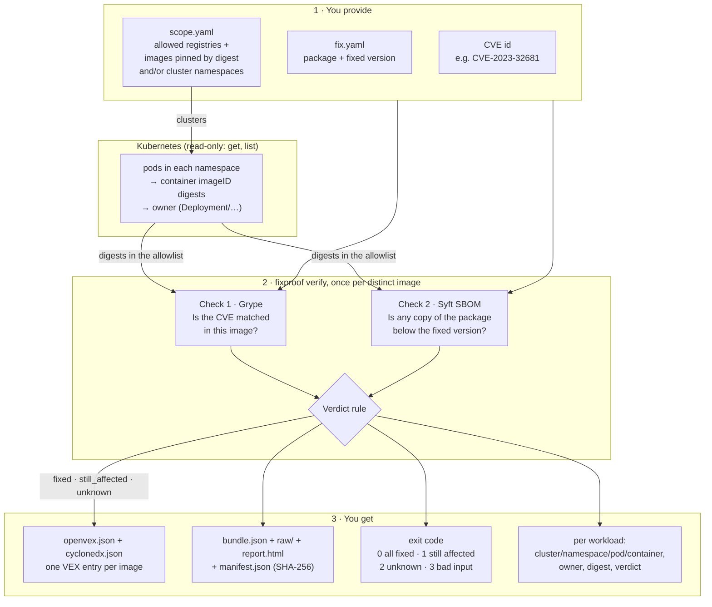
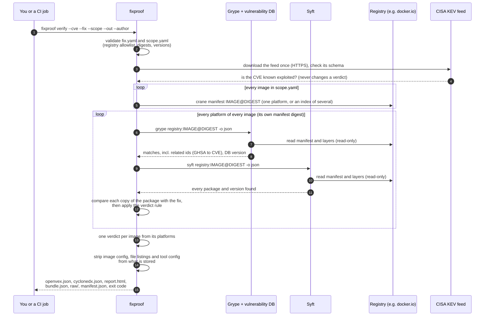
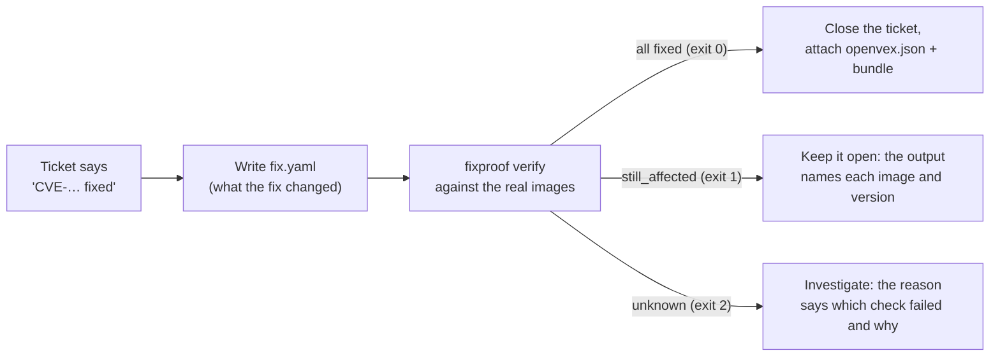

# fixproof

**Proof, image by image, that a remediated CVE is actually gone, not just that the ticket closed.**

[](https://github.com/Govardhan527/fixproof/actions/workflows/ci.yml)
[](https://github.com/Govardhan527/fixproof/actions/workflows/live.yml)

A ticket says "CVE fixed". fixproof checks that claim against the container images you actually
ship. For each image it answers one question: **is the vulnerable component still there?**

- `fixed`: two independent checks both say the vulnerable version is gone.
- `still_affected`: at least one check finds it, and nothing contradicts that.
- `unknown`: the checks disagree or could not run. fixproof never turns `unknown` into `fixed`.

It writes the answer as an [OpenVEX](https://github.com/openvex/spec) document and as CycloneDX
VEX, with an HTML summary and an evidence bundle (every tool output, hashed), and exits with a
code your CI can act on.

> **Status: 0.1.0.post1, alpha** ([PyPI](https://pypi.org/project/fixproof/)). Image verification is
> exercised weekly against real public images (see [Live demo](#live-demo-a-real-run)).
> Kubernetes workloads are checked in CI on real nodes with all three common container runtimes:
> kind (containerd), with the six SUCCESS TEST workloads, real certbot releases and every edge
> case, and minikube with Docker Engine and with CRI-O. The release gate (`fixproof gate`) is
> checked in CI on real built images (Docker daemon, `docker save` and OCI archives, registry),
> and every run reports the CVE's CISA KEV status and writes an HTML summary and CycloneDX VEX;
> see [Roadmap](#roadmap).
> fixproof produces evidence for your own review. It is not a certification.

---

## Contents

- [How it works](#how-it-works)
- [Live demo: a real run](#live-demo-a-real-run)
- [Install](#install)
- [Using fixproof](#using-fixproof)
- [Reading the results](#reading-the-results)
- [Use in CI](#use-in-ci)
- [Supported package ecosystems](#supported-package-ecosystems)
- [Credentials, privacy and what is stored](#credentials-privacy-and-what-is-stored)
- [Limitations](#limitations)
- [Roadmap](#roadmap)
- [Run the SUCCESS TEST yourself: `make demo`](#run-the-success-test-yourself-make-demo)
- [Development](#development)

---

## How it works

### The whole flow

You give fixproof three things: the CVE id, the claimed fix, and what to check: images pinned by
digest, Kubernetes namespaces, or both. For a namespace it first lists the pods and finds the
digest each container runs. For every image it runs two independent checks, combines them with a
strict rule, and writes the results; each workload takes the verdict of the image it runs.



### One image, step by step

Both tools read the image straight from the registry by digest (no Docker daemon needed, nothing
is run). fixproof checks that the digest the tools scanned is the one you asked for. A
multi-platform image is checked on each of its Linux platforms ([details](#multi-platform-images);
not in 0.1.0.post1).



### The verdict rule

Each check returns **present**, **not present** or **error**. They are combined like this, and
the reason always quotes both checks:


| Grype | SBOM check | Verdict |
|---|---|---|
| not present | not present | **fixed** |
| present | present | **still_affected** |
| present | error | **still_affected** |
| error | present | **still_affected** |
| present | not present | **unknown** (disagree) |
| not present | present | **unknown** (disagree) |
| not present | error | **unknown** |
| error | not present | **unknown** |
| error | error | **unknown** |

### Where it fits in your remediation workflow

fixproof never closes tickets. It gives the people who do the evidence to decide.



---

## Live demo: a real run

This is an unedited run from 2026-10-04, with fixproof 0.1.0 installed from PyPI, against three
public images that fixproof did not build.

**The question:** is [CVE-2023-32681](https://github.com/advisories/GHSA-j8r2-6x86-q33q) (Python
`requests` leaks `Proxy-Authorization` headers; affects `>= 2.3.0, < 2.31.0`, fixed in `2.31.0`)
gone from these releases of the official Certbot image?

**The expected answer comes from a source independent of fixproof:** Certbot pins `requests` in
`tools/requirements.txt` at each release tag, and its image build installs with those pins.

| Image | Certbot pins | Expected |
|---|---|---|
| `certbot/certbot` v2.6.0 | `requests==2.28.2` | still_affected |
| `certbot/certbot` v2.7.0 | `requests==2.31.0` | fixed |
| `certbot/certbot` v5.8.0 | `requests==2.34.2` | fixed |

`fix.yaml`:

```yaml
schema_version: "1.0.0"
cve: CVE-2023-32681
packages:
  - ecosystem: pypi
    name: requests
    fixed_version: "2.31.0"
```

`scope.yaml`:

```yaml
schema_version: "1.0.0"
registries: [docker.io]
images:
  - docker.io/certbot/certbot@sha256:92092d214a4eb75d049720d04f7acc50b40ea226d77736bce6a6bf43981b6e86  # v2.6.0
  - docker.io/certbot/certbot@sha256:68e0f51ce9037d3b022d446772277beb1e9c0fe801e75fbf87db105ab165ad54  # v2.7.0
  - docker.io/certbot/certbot@sha256:f70ad0adbb7e117f0fe42a63c553f28ea451edabc0148757b6efcd9735acaa20  # v5.8.0
```

The run (Syft 1.54.0, Grype 0.119.0, Grype DB v6.1.10 built that morning, no registry
credentials; 100 seconds):

```console
$ fixproof verify --cve CVE-2023-32681 --fix fix.yaml --scope scope.yaml \
    --out evidence --author "Example VM team <vm@example.com>"
still_affected  docker.io/certbot/certbot@sha256:92092d214a4eb75d049720d04f7acc50b40ea226d77736bce6a6bf43981b6e86
                both methods find the vulnerable component. grype: CVE-2023-32681: pkg:pypi/requests@2.28.2 matches GHSA-j8r2-6x86-q33q. sbom_version: requests 2.28.2 at /usr/local/lib/python3.10/site-packages/requests-2.28.2.dist-info/METADATA is below the fix (2.31.0).
fixed           docker.io/certbot/certbot@sha256:68e0f51ce9037d3b022d446772277beb1e9c0fe801e75fbf87db105ab165ad54
                both methods agree the vulnerable component is gone. grype: no match for CVE-2023-32681 among 247 matches. sbom_version: requests 2.31.0 at /usr/local/lib/python3.10/site-packages/requests-2.31.0.dist-info/METADATA is fixed.
fixed           docker.io/certbot/certbot@sha256:f70ad0adbb7e117f0fe42a63c553f28ea451edabc0148757b6efcd9735acaa20
                both methods agree the vulnerable component is gone. grype: no match for CVE-2023-32681 among 33 matches. sbom_version: requests 2.34.2 at /usr/local/lib/python3.14/site-packages/requests-2.34.2.dist-info/METADATA is fixed.
KEV: CVE-2023-32681 is not in the CISA KEV catalogue (feed 2026.10.02, released 2026-10-02T15:19:38.2945Z)
2 fixed, 1 still_affected, 0 unknown; evidence in evidence
$ echo $?
1
```

All three verdicts match the expected answers. Note what the output shows:

- Grype reports the PyPI match under its GitHub advisory id (`GHSA-j8r2-…`); fixproof follows the
  advisory's related ids to the CVE, so the match is not missed.
- The SBOM check names the exact file the version came from.
- The `KEV:` line reports whether the CVE is known to be exploited, from CISA's feed downloaded
  for this run; it never changes a verdict.
- The exit code is `1` because one image is still affected.

What was written:

```console
$ find evidence -type f | sort
evidence/bundle.json
evidence/cyclonedx.json
evidence/manifest.json
evidence/openvex.json
evidence/raw/001-grype.json
evidence/raw/001-sbom_version.json
evidence/raw/002-grype.json
evidence/raw/002-sbom_version.json
evidence/raw/003-grype.json
evidence/raw/003-sbom_version.json
evidence/report.html
```

The VEX statement for the still-affected image (from `openvex.json`, long notes abridged with `…`):

```json
{
  "action_statement": "Upgrade pkg:pypi/requests to 2.31.0 or later.",
  "products": [
    {
      "@id": "pkg:oci/certbot@sha256:92092d214a4eb75d049720d04f7acc50b40ea226d77736bce6a6bf43981b6e86?repository_url=docker.io%2Fcertbot%2Fcertbot",
      "identifiers": {
        "purl": "pkg:oci/certbot@sha256:92092d214a4eb75d049720d04f7acc50b40ea226d77736bce6a6bf43981b6e86?repository_url=docker.io%2Fcertbot%2Fcertbot"
      },
      "subcomponents": [{ "@id": "pkg:pypi/requests", "identifiers": { "purl": "pkg:pypi/requests" } }]
    }
  ],
  "status": "affected",
  "status_notes": "both methods find the vulnerable component. grype: … sbom_version: requests 2.28.2 at …/requests-2.28.2.dist-info/METADATA is below the fix (2.31.0).",
  "vulnerability": { "name": "CVE-2023-32681" }
}
```

The tool and data versions recorded in `bundle.json` (URLs and hashes abridged), so the run can
be judged later:

```json
"tools": [
  { "name": "grype", "version": "0.119.0",
    "db": { "schemaVersion": "v6.1.10", "built": "2026-10-04T08:11:47Z", "from": "https://grype.anchore.io/databases/v6/vulnerability-db_v6.1.10_…tar.zst?checksum=sha256%3A2bd874…" } },
  { "name": "syft", "version": "1.54.0", "schema": "16.1.11" }
],
"kev": { "status": "not_listed", "entry": null, "reason": null,
  "feed": { "catalog_version": "2026.10.02", "count": 1733, "date_released": "2026-10-02T15:19:38.2945Z",
            "retrieved": "2026-10-04T13:13:50Z", "sha256": "d2c8c6…", "url": "https://www.cisa.gov/…/known_exploited_vulnerabilities.json" } }
```

Anyone holding the bundle can check that nothing was changed after the run:

```console
$ cd evidence && jq -r '.files[] | "\(.sha256)  \(.path)"' manifest.json | sha256sum --check --quiet && echo "all files match"
all files match
```

The same kind of check runs every week in CI against real images for Python, Debian (glibc
CVE-2023-4911, in CISA KEV), Alpine and AlmaLinux (OpenSSL), and a Java jar (Log4Shell,
CVE-2021-44228, in CISA KEV). Each case's expected verdict has an independent source; see
[`tests/live/test_public_images.py`](https://github.com/Govardhan527/fixproof/blob/main/tests/live/test_public_images.py).

### A real run on a kind cluster

This run is from CI run
[37112944135](https://github.com/Govardhan527/fixproof/actions/runs/37112944135) (2026-10-03),
against the demo cluster that [`scripts/demo_cluster.sh`](https://github.com/Govardhan527/fixproof/blob/main/scripts/demo_cluster.sh) builds: six
Deployments in namespace `fixproof-demo`, five from an open local registry and one
(`partner-gateway`) from a registry that needs a password. The cluster pulls `partner-gateway`
with an image pull secret; fixproof gets only the read-only `fixproof-reader` token and no
registry credentials. Scope: [`examples/scope/kind-demo.yaml`](https://github.com/Govardhan527/fixproof/blob/main/examples/scope/kind-demo.yaml).
Long reasons are abridged with `…`; everything else is as printed. That run predates the KEV
check, so fixproof 0.1.0 and later print one more line, `KEV: …`, before the summary (as in the live demo
above).

```console
$ export KUBECONFIG=reader.kubeconfig DOCKER_CONFIG=no-credentials
$ fixproof verify --cve CVE-2023-32681 --fix fix.yaml --scope examples/scope/kind-demo.yaml \
    --out evidence --author "fixproof CI demo"
still_affected  kind-fixproof/fixproof-demo/billing-67b7db4d78-lttsw/app  Deployment/billing
                localhost:5001/fixproof/requests-2.25.1@sha256:03c2e314aa42e4bcb2eb4c2eee32896d121cfefa7343e3cc644256a53126b660
                both methods find the vulnerable component. grype: CVE-2023-32681: pkg:pypi/requests@2.25.1 matches GHSA-j8r2-6x86-q33q. sbom_version: requests 2.25.1 at …/requests-2.25.1.dist-info/METADATA is below the fix (2.31.0).
still_affected  kind-fixproof/fixproof-demo/orders-b845c4c74-86x5f/app  Deployment/orders
                localhost:5001/fixproof/requests-2.30.0@sha256:ca6caa03e5ae870034fc02e26f07e2511328050766e6b53bcba5c0889b8cdfa6
                both methods find the vulnerable component. grype: CVE-2023-32681: pkg:pypi/requests@2.30.0 matches GHSA-j8r2-6x86-q33q. sbom_version: requests 2.30.0 at …/requests-2.30.0.dist-info/METADATA is below the fix (2.31.0).
unknown         kind-fixproof/fixproof-demo/partner-gateway-5d6f7d95c8-qt77n/app  Deployment/partner-gateway
                localhost:5002/fixproof/requests-2.31.0@sha256:d8696080016a8241f68568bd21a9eb3eb612d774014b29f80444c0d7620fbb3e
                both methods failed. grype: grype exited 1: - oci-model: failed to fetch descriptor: GET http://localhost:5002/v2/fixproof/requests-2.31.0/manifests/sha256:d869…: UNAUTHORIZED: authe…. sbom_version: syft exited 1: … UNAUTHORIZED: authe….
fixed           kind-fixproof/fixproof-demo/payments-8564c469df-pfcbf/app  Deployment/payments
                localhost:5001/fixproof/requests-2.31.0@sha256:7efe6533c644b0959ecb99615632b242fd529bdd136c6c2208fb3021db72d22f
                both methods agree the vulnerable component is gone. grype: no match for CVE-2023-32681 among 287 matches. sbom_version: requests 2.31.0 at …/requests-2.31.0.dist-info/METADATA is fixed.
still_affected  kind-fixproof/fixproof-demo/reports-589678bff6-54l85/app  Deployment/reports
                localhost:5001/fixproof/venv-only@sha256:1bde4034b260957c7611f8f06889399656df040991c2cf01936b7f117af9b7c1
                both methods find the vulnerable component. grype: CVE-2023-32681: pkg:pypi/requests@2.30.0 matches GHSA-j8r2-6x86-q33q. sbom_version: requests 2.30.0 at /opt/app/venv/…/requests-2.30.0.dist-info/METADATA is below the fix (2.31.0).
fixed           kind-fixproof/fixproof-demo/search-6d9f7cb8f9-cxpf7/app  Deployment/search
                localhost:5001/fixproof/requests-2.32.3@sha256:2a46b13cde10bed033b448639b386e97fca2946b6267f9a7d09b37850c4ced06
                both methods agree the vulnerable component is gone. grype: no match for CVE-2023-32681 among 286 matches. sbom_version: requests 2.32.3 at …/requests-2.32.3.dist-info/METADATA is fixed.
2 fixed, 3 still_affected, 1 unknown; evidence in evidence
$ echo $?
1
```

`reports` is the case a version check on the system Python alone would miss: `requests` 2.30.0
lives only in a virtual environment at `/opt/app/venv`. The same CI job checks two real Certbot
releases running as pods (v2.6.0 `still_affected`, v2.7.0 `fixed`) and that the reader account
gets `403 Forbidden` outside its namespaces.

---

## Install

**Requirements:** Python 3.12+, [uv](https://docs.astral.sh/uv/) or
[pipx](https://pipx.pypa.io/), network access to your registries, and Syft 1.54.0 and Grype
0.119.0 on `PATH` (and crane 0.22.1, which lists an image's platforms; not needed by 0.1.0.post1). fixproof itself
is pure Python; the scanner install script below fetches the Linux x86-64 builds (on other
platforms, install those versions from their release pages).

**1. Install fixproof** from [PyPI](https://pypi.org/project/fixproof/), in an environment of its
own:

```console
$ uv tool install fixproof        # or: pipx install fixproof
$ fixproof --version
fixproof 0.1.0.post1
```

**2. Install the pinned scanners** (Syft 1.54.0 and Grype 0.119.0; each download is checked
against its SHA-256 before it is unpacked). Download the script, read it, then run it:

```console
$ curl -sSfLO https://raw.githubusercontent.com/Govardhan527/fixproof/v0.1.0.post1/scripts/install_scanners.sh
$ less install_scanners.sh
$ bash install_scanners.sh "$HOME/.local/bin"      # any directory on your PATH
```

**3. Download the vulnerability database**, and refresh it before each session:

```console
$ grype db update        # about 3 GB on disk
$ grype db status
```

fixproof never downloads the database itself and never lets Grype update it mid-run. A database
older than Grype's limit (120 hours by default) makes the Grype check fail, so the verdict is
`unknown`, never `fixed`.

---

## Using fixproof

### Step 1. Describe the fix: `fix.yaml`

| Field | Required | Meaning |
|---|---|---|
| `schema_version` | yes | `"1.0.0"` |
| `cve` | yes | The CVE the fix closes. Must equal `--cve`, so a fix file for another CVE is refused. |
| `packages` | yes | One entry per package the fix changes (a fix often touches several binary packages). |
| `packages[].ecosystem` | yes | `deb`, `rpm`, `apk`, `pypi`, `npm` or `maven` |
| `packages[].namespace` | depends | The [purl](https://github.com/package-url/purl-spec) namespace: the distro for `deb`, `rpm`, `apk` (e.g. `debian`, `almalinux`, `alpine`); the `groupId` for `maven`; the scope for `npm` (optional); none for `pypi`. |
| `packages[].name` | yes | Package name as the package manager knows it |
| `packages[].fixed_version` | yes | Every version **at or above** this is fixed. Quote it in YAML (`1.10` unquoted is the number 1.1). |
| `packages[].fixed_vers` | no | Extra fixed ranges for backports, as a [vers](https://github.com/package-url/vers-spec) string |

Examples:

```yaml
# Debian: glibc "Looney Tunables" (CVE-2023-4911), fixed in bookworm 2.36-9+deb12u3,
# with the bullseye backport 2.31-13+deb11u7 given as an extra fixed range.
schema_version: "1.0.0"
cve: CVE-2023-4911
packages:
  - ecosystem: deb
    namespace: debian
    name: libc6
    fixed_version: "2.36-9+deb12u3"
    fixed_vers: "vers:deb/>=2.31-13+deb11u7|<2.32"
  - ecosystem: deb
    namespace: debian
    name: libc-bin
    fixed_version: "2.36-9+deb12u3"
    fixed_vers: "vers:deb/>=2.31-13+deb11u7|<2.32"
```

```yaml
# RPM: versions carry the epoch, as rpm and Syft print them.
  - ecosystem: rpm
    namespace: almalinux
    name: openssl-libs
    fixed_version: "1:3.0.1-47.el9_1"
```

```yaml
# Maven: Log4Shell (CVE-2021-44228), fixed in 2.15.0, with backports 2.12.2 and 2.3.1.
  - ecosystem: maven
    namespace: org.apache.logging.log4j
    name: log4j-core
    fixed_version: "2.15.0"
    fixed_vers: "vers:maven/>=2.3.1|<2.4|>=2.12.2|<2.13"
```

Take the fixed versions from the distribution's or project's own advisory (Debian security
tracker, Red Hat security data, Alpine secdb, GitHub advisories), not from the scanner.

### Step 2. Describe what to check: `scope.yaml`

| Field | Required | Meaning |
|---|---|---|
| `schema_version` | yes | `"1.0.0"`, or `"1.1.0"` to use `platforms` |
| `registries` | yes | The allowlist: registry hosts fixproof may read from (`host[:port]`). |
| `images` | `images`, `clusters` or both | Full references **pinned by digest**: `registry/repository@sha256:<64 hex>`. The registry host is required (no implied Docker Hub) and must be in `registries`. Tags are refused: a tag can move, a digest cannot. |
| `clusters` | `images`, `clusters` or both | Running workloads to check: each entry names a kubeconfig `context` and the `namespaces` to read. See [Kubernetes workloads](#kubernetes-workloads). |
| `platforms` | no (1.1.0) | Which platforms of a multi-platform image to check, e.g. `[linux/amd64, linux/arm64]`; without it, every Linux platform. See [Multi-platform images](#multi-platform-images). |

```yaml
schema_version: "1.0.0"
registries: [registry.example.com, docker.io]
images:
  - registry.example.com/payments/api@sha256:4c1c5b3a5e2e6d7f8a9b0c1d2e3f405162738495a6b7c8d9e0f1a2b3c4d5e6f7
  - docker.io/library/nginx@sha256:…
```

```yaml
# Running workloads: every container in these namespaces, by the digest it actually runs.
schema_version: "1.0.0"
registries: [registry.example.com, docker.io]
clusters:
  - context: prod-eu-1          # a context in your kubeconfig
    namespaces: [payments, checkout]
```

To find an image's digest: `docker buildx imagetools inspect IMAGE:TAG`, `crane digest IMAGE:TAG`,
or `skopeo inspect docker://IMAGE:TAG`. JSON Schemas for both files ship in
[`src/fixproof/schemas/`](https://github.com/Govardhan527/fixproof/tree/main/src/fixproof/schemas/); point your editor's YAML schema support at them
to catch mistakes while you type.

### Multi-platform images

*(Not in 0.1.0.post1.)*

Many images are an index of several platforms (`linux/amd64`, `linux/arm64`, …), and each node or
laptop pulls the one for its own CPU. fixproof reads the image's manifest with
[crane](https://github.com/google/go-containerregistry/tree/main/cmd/crane), then checks every
Linux platform through that platform's own manifest digest, so a verdict never describes a
platform it did not check:

- the image is `fixed` only if every platform checked is `fixed`, `still_affected` if any platform
  is, and `unknown` otherwise;
- each platform gets its own line, verdict and evidence (illustrative):

```text
still_affected  docker.io/team/app@sha256:4c1c5b3a…
                2 platforms checked: linux/amd64 fixed, linux/arm64 still_affected.
                linux/amd64: both methods agree the vulnerable component is gone. grype: … sbom_version: …
                linux/arm64: both methods find the vulnerable component. grype: … sbom_version: …
                Not checked: linux/arm/v7 (not in platforms).
```

To check only the platforms your nodes run, list them (`scope.yaml` 1.1.0; `closed.yaml` 1.1.0
takes the same list for `gate`):

```yaml
schema_version: "1.1.0"
registries: [docker.io]
images:
  - docker.io/team/app@sha256:4c1c5b3a5e2e6d7f8a9b0c1d2e3f405162738495a6b7c8d9e0f1a2b3c4d5e6f7
platforms: [linux/amd64, linux/arm64]
```

`linux/arm64` also matches `linux/arm64/v8`, and `linux/arm` matches `linux/arm/v7`, as containerd
matches them. A single-platform image is checked whatever its platform; build attestations in an
index are not platforms. crane reads registries exactly as Syft and Grype do (the same Docker
config and credential helpers), and fixproof itself never reads a credential.

### Kubernetes workloads

fixproof lists the pods in each namespace and takes every container's image from its status
(`imageID`): the digest the node actually pulled, not the tag in the pod spec. Init containers
count; ephemeral debug containers do not. Each image is scanned once however many pods run it
(on each of its platforms), and every workload gets that image's verdict, shown with its pod
name and owner. Example output
(illustrative; names and digests invented):

```text
still_affected  prod-eu-1/payments/api-7d9f8-x2kq4/app  Deployment/api
                registry.example.com/payments/api@sha256:4c1c5b3a…
                both methods find the vulnerable component. grype: … sbom_version: …
unknown         prod-eu-1/payments/worker-5c6b7-p9zt1/app  Deployment/worker
                image not resolved
                image digest not resolved: the container has not started (ImagePullBackOff)
```

The digest is always the one the pod runs. The registry shown is the node's name for that digest:
if the node holds the same digest under two registries, it may name either one, and fixproof
reads the content through that name only if it is in `registries`.

A workload is `unknown`, with the reason, when its container has not started, when its image
has no registry digest, or when its registry is not in `registries`: fixproof never reads an
image from outside the allowlist. An image loaded straight into a kind node (`kind load`) is
reported by the node as `docker.io/library/import-<date>@sha256:…`, a name no registry holds,
so it comes out `unknown` too.

**Container runtimes.** CI proves three runtimes on real nodes. containerd (kind; also minikube's
default) and CRI-O report `registry/repository@sha256:…`; CRI-O may give the digest of the
platform manifest the node runs (for example the `linux/amd64` entry of a multi-platform image)
rather than the index digest in the pod spec, and fixproof then scans exactly that. Docker Engine
through cri-dockerd (for example minikube with `--container-runtime=docker`) reports
`docker-pullable://` and Docker's short name, which fixproof expands with Docker's own rule
(`python` → `docker.io/library/python`, `certbot/certbot` → `docker.io/certbot/certbot`). From
a minikube node with Docker Engine 29.7.2 (CI run
[37123230999](https://github.com/Govardhan527/fixproof/actions/runs/37123230999); reasons
abridged with `…`):

```text
still_affected  fixproof-docker/fixproof-docker/certbot-by-tag-7c758fd4f-59xwv/app  Deployment/certbot-by-tag
                docker.io/certbot/certbot@sha256:92092d214a4eb75d049720d04f7acc50b40ea226d77736bce6a6bf43981b6e86
                both methods find the vulnerable component. grype: … sbom_version: requests 2.28.2 at … is below the fix (2.31.0).
unknown         fixproof-docker/fixproof-docker/local-only-88596bcf4-wvjpl/app  Deployment/local-only
                image not resolved
                image digest not resolved: imageID 'docker://sha256:2a3c286d…' has no registry digest
fixed           fixproof-docker/fixproof-docker/python-official-5c45b87c69-5t8k2/app  Deployment/python-official
                docker.io/library/python@sha256:54c85f3c47607a77f32adec749d3c81d1348bf25833671f512b26a9b6d778cb3
                both methods agree the vulnerable component is gone. grype: … sbom_version: no requests package among 113 packages.
```

The pod `certbot-by-tag` names its image `certbot/certbot:v2.6.0`; the node reports the digest it
runs, which is what fixproof checks. An image loaded straight into the node, with no registry
digest, is `unknown`. From a CRI-O 1.35.7 node (CI run
[37134011580](https://github.com/Govardhan527/fixproof/actions/runs/37134011580); reasons
abridged with `…`), where the pod `certbot-2-7-0` names the multi-platform index `68e0f5…` and the
node reports its `linux/amd64` manifest:

```text
fixed           fixproof-crio/fixproof-crio/certbot-2-7-0-6c86db7d76-5z2vb/app  Deployment/certbot-2-7-0
                docker.io/certbot/certbot@sha256:0a228a84eab88b893de30d3f0b027ee3cf08c681fde1c9f712e3f94e295d1f4f
                both methods agree the vulnerable component is gone. grype: … sbom_version: requests 2.31.0 at … is fixed.
unknown         fixproof-crio/fixproof-crio/local-only-64d94bdb8c-svc4h/app  Deployment/local-only
                localhost/fixproof-local@sha256:5ac6fd5093f78ce0ac1a661f431f4cfb2590c659f0bf43b81af7cccb2fa6258d
                registry not in scope: localhost; fixproof did not read the image
```

**Managed clusters and cloud registries** *(the sign-in message below is not in 0.1.0.post1)*.
Managed clusters sign in through an exec plugin in the kubeconfig: `aws eks update-kubeconfig`
writes one that runs `aws eks get-token`, `gcloud container clusters get-credentials` one that
runs `gke-gcloud-auth-plugin`, and AKS clusters with Microsoft Entra sign-in use the
[kubelogin](https://github.com/Azure/kubelogin) plugin. fixproof uses such a kubeconfig as kubectl
does: run fixproof as an identity your cloud maps to
the read-only account below. If the plugin fails (an expired session, say), fixproof stops with
exit 3 and the plugin's own message. Cloud registries sign in through a Docker credential
helper in `~/.docker/config.json`, for example Amazon ECR's:

```json
{ "credHelpers": { "123456789012.dkr.ecr.eu-west-1.amazonaws.com": "ecr-login" } }
```

with `docker-credential-ecr-login` on `PATH`; crane, Syft and Grype all ask the helper, and
fixproof never sees the credential. Both mechanisms (an exec plugin with
`client.authentication.k8s.io/v1beta1` and `v1`, and a helper in `credHelpers` or `credsStore`)
are tested on every change, on a kind cluster; EKS, GKE and AKS themselves are not, see
[Limitations](#limitations).

**Access.** fixproof needs `get` and `list` on `pods` and `replicasets` in the namespaces it
reads, and nothing else. [`deploy/kubernetes/`](https://github.com/Govardhan527/fixproof/tree/main/deploy/kubernetes/) ships a ServiceAccount and a
namespaced Role and RoleBinding for exactly that. As a cluster admin:

```console
$ kubectl apply -f deploy/kubernetes/fixproof-reader.yaml          # once: the account
$ kubectl apply -n payments -f deploy/kubernetes/fixproof-reader-role.yaml
$ kubectl apply -n checkout -f deploy/kubernetes/fixproof-reader-role.yaml
```

Then give fixproof a kubeconfig with a short-lived token for that account, and nothing more:

```console
$ TOKEN="$(kubectl create token fixproof-reader -n fixproof --duration=1h)"
$ kubectl config view --raw --minify --flatten -o jsonpath='{.clusters[0].cluster.certificate-authority-data}' \
    | base64 -d > ca.crt
$ export KUBECONFIG="$PWD/fixproof.kubeconfig"
$ kubectl config set-cluster prod-eu-1 --server=https://… --certificate-authority=ca.crt --embed-certs=true
$ kubectl config set-credentials fixproof-reader --token="$TOKEN"
$ kubectl config set-context prod-eu-1 --cluster=prod-eu-1 --user=fixproof-reader
```

Run the `view` command against your admin kubeconfig before switching `KUBECONFIG`. fixproof
reads `KUBECONFIG` (or `~/.kube/config`) like kubectl, and the context name in `scope.yaml` is
the one shown in its output.

### Step 3. Run

```console
$ fixproof verify --cve CVE-2023-4911 --fix fix.yaml --scope scope.yaml \
    --out evidence-2026-10-02 --author "Platform security <security@example.com>"
```

| Option | Meaning |
|---|---|
| `--cve` | The CVE the fix claims to close |
| `--fix` | Path to `fix.yaml` |
| `--scope` | Path to `scope.yaml` |
| `--out` | A **new or empty** directory. fixproof never overwrites evidence. |
| `--author` | Who issues the VEX (OpenVEX `author`), e.g. your team and address |
| `--json` | Print a machine-readable summary on stdout ([schema](https://github.com/Govardhan527/fixproof/blob/main/src/fixproof/schemas/verify-summary.schema.json), [example](https://github.com/Govardhan527/fixproof/blob/main/examples/verify-summary/three-images.json)) |
| `--jobs` | How many image platforms to scan at the same time (default 4; each scan peaks at about 300 MB). The results are the same for any value; `--jobs 1` scans one at a time. |

---

## Reading the results

### Exit codes

| Code | Meaning | Typical action |
|---|---|---|
| `0` | Every image and workload is `fixed` | Close with the evidence attached |
| `1` | At least one is `still_affected` | Keep the ticket open; fix the listed images |
| `2` | None still affected, but at least one `unknown` | Investigate the reason (credentials, stale DB, disagreement) |
| `3` | Bad input or usage (invalid file, wrong CVE, existing `--out`, …), or a cluster fixproof cannot read (kubeconfig context missing, API unreachable, or `403` for a namespace) | Fix the command, the input files or the access |

### The evidence bundle

| File | What it holds |
|---|---|
| `openvex.json` | One OpenVEX v0.2.0 statement per image, validated against the official schema before it is written |
| `cyclonedx.json` | The same verdicts as CycloneDX 1.6 VEX, one entry per image, validated against the official 1.6.2 schema before it is written |
| `report.html` | A self-contained page for people: the counts, the KEV status, and every image or workload with its verdict, digest and reason. No JavaScript; it loads nothing from the network. |
| `bundle.json` | Run times, fixproof version, SHA-256 of `fix.yaml` and `scope.yaml`, Syft/Grype/DB versions, the CISA KEV feed used (or why it could not be read), and per image or workload: verdict, reason, and for each platform checked its manifest digest, verdict, reason, both check results and what each tool scanned, plus the platforms not checked and why; a workload also has its cluster, namespace, pod, container and owner |
| `raw/NNN-grype.json`, `raw/NNN-sbom_version.json` | Each tool's own output for asset NNN, minus anything that is not package metadata (see below); `raw/NNN-linux-arm64-grype.json` and so on for an image with several platforms. Workloads running the same image share its files. |
| `manifest.json` | SHA-256 and size of every other file |

### How verdicts become VEX

| fixproof verdict | OpenVEX `status` | Extra fields |
|---|---|---|
| `fixed` | `fixed` | `status_notes` with both checks' findings |
| `still_affected` | `affected` | `action_statement` ("Upgrade … to … or later"), `status_notes` |
| `unknown` | `under_investigation` | `status_notes` with the reason |

The CycloneDX VEX uses the spec's own definitions of each `analysis.state`:

| fixproof verdict | CycloneDX `analysis.state` | Spec definition |
|---|---|---|
| `fixed` | `resolved` | "The vulnerability has been remediated." |
| `still_affected` | `exploitable` (response `update`) | "The vulnerability may be directly or indirectly exploitable." |
| `unknown` | `in_triage` | "The vulnerability is being investigated." |

fixproof never writes `not_affected` (or CycloneDX `false_positive`): that would claim more than
two scans can prove.

### CISA KEV

Every `verify` and `gate` run downloads the CISA Known Exploited Vulnerabilities feed over
HTTPS, checks it against CISA's own schema, and reports whether the CVE is in it, with the date
CISA added it, the due date and known ransomware use. The bundle records the feed's version,
release time, retrieval time and SHA-256. KEV status is information for you: it never changes a
verdict or an exit code. If the feed cannot be read (no network, CISA down, an invalid file),
the run says `KEV: unavailable` with the reason and carries on.

---

## Use in CI

Run `fixproof verify` on the images a release ships and let the exit code decide. A sketch for
GitHub Actions:

```yaml
- name: Install fixproof and the scanners
  run: |
    pipx install fixproof==0.1.0.post1   # GitHub's Ubuntu runners have pipx and Python 3.12
    curl -sSfLO https://raw.githubusercontent.com/Govardhan527/fixproof/v0.1.0.post1/scripts/install_scanners.sh
    bash install_scanners.sh "$RUNNER_TEMP/bin" && echo "$RUNNER_TEMP/bin" >> "$GITHUB_PATH"
    grype db update
- name: Prove the fix
  run: |
    fixproof verify --cve CVE-2023-4911 --fix security/fix.yaml --scope security/scope.yaml \
      --out evidence --author "Release pipeline <security@example.com>" --json > fixproof.json
- name: Keep the evidence
  if: always()
  uses: actions/upload-artifact@v4   # pin to a commit SHA in real use
  with: { name: fixproof-evidence, path: evidence }
```

Any non-zero exit code fails the step: `1` still affected, `2` unknown, `3` bad input. If
`unknown` should not block a release, check the code yourself and fail only on `1` and `3`.

### The release gate: never ship a closed CVE again

Once a CVE is closed, list it in `closed.yaml` with the fix that closed it (the same package
list as `fix.yaml`), and gate every build on it:

```yaml
schema_version: "1.0.0"
registries: [registry.example.com]  # only needed to gate a registry image
closed:
  - cve: CVE-2023-32681
    packages:
      - ecosystem: pypi
        name: requests
        fixed_version: "2.31.0"
```

```yaml
- name: Build
  run: docker build -t app:ci .
- name: Gate the release on every closed CVE
  run: fixproof gate --closed security/closed.yaml --image docker:app:ci
```

`--image` takes the image where your pipeline has it: `docker:NAME[:TAG]` (the local Docker
daemon), `docker-archive:PATH` (`docker save`), `oci-archive:PATH`, or a registry image pinned
by digest (optionally written `registry:…`) from a registry in `closed.yaml`. Each closed CVE
gets both checks and the verdict rule, as in `verify`, and the output names the image ID and
manifest digest that were read. A multi-platform registry image is checked on each Linux
platform, or on those `closed.yaml` 1.1.0 lists in `platforms` ([details](#multi-platform-images);
not in 0.1.0.post1). If the two checks read different images (a tag moved between
them, say), nothing is proven and every closed CVE is `unknown`.

On a workstation, the same check:

```console
$ docker build -t app:ci .
$ fixproof gate --closed closed.yaml --image docker:app:ci
```

| Option | Meaning |
|---|---|
| `--closed` | Path to `closed.yaml` |
| `--image` | The built image: `docker:NAME[:TAG]`, `docker-archive:PATH`, `oci-archive:PATH`, or a registry image pinned by digest |
| `--json` | Print the result as JSON instead of text |
| `--out` | A **new or empty** directory to keep the decision in (*not in 0.1.0.post1*): `gate.json` (the result, the fixproof version, start and end times, the SHA-256 of `closed.yaml`), each tool's sanitised output under `raw/`, and `manifest.json` with the SHA-256 of every file |

| Exit | Meaning |
|---|---|
| `0` | Every closed CVE is proven gone from this image: ship |
| `1` | At least one closed CVE is back: block the release |
| `2` | None is back, but at least one could not be proven (the reason is printed): block, then fix the cause. "Not proven gone" is never treated as "gone". |
| `3` | Bad input (`closed.yaml`, the image argument) |

`--json` prints the result ([schema](https://github.com/Govardhan527/fixproof/blob/main/src/fixproof/schemas/gate-result.schema.json),
[example](https://github.com/Govardhan527/fixproof/blob/main/examples/gate-result/reintroduced.json)).

---

## Supported package ecosystems

| Ecosystem | Version rules | Checked against | Notes |
|---|---|---|---|
| `deb` | Debian Policy §5.6.12 | python-debian on 6,000+ seeded pairs (test-only) | epochs, `~` pre-releases |
| `rpm` | `rpm-version(7)` | rpm's own 91 test vectors (development) | epochs, `~` and `^` |
| `apk` | apk-tools 3 behaviour | apk-tools' 709 test lines (development) | versions where apk-tools 2 and 3 differ (`1.05`, `~hash`) are refused: `unknown` |
| `pypi` | PEP 440 (`packaging`) | the specification's own ordering example | epochs, pre/post/dev releases |
| `npm` | SemVer 2.0.0 precedence | semver.org examples, node-semver fixtures | strict syntax; a leading `v` is refused |
| `maven` | Maven's own comparator (ported) | every vector in Maven's test class | versions containing `_` are refused (Maven's docs and code disagree) |

A version fixproof cannot parse or compare makes the SBOM check fail, so the verdict is
`unknown`, never `fixed`.

---

## Credentials, privacy and what is stored

- **Registry credentials** come from the standard places only (`~/.docker/config.json`,
  `$DOCKER_CONFIG`, or the tools' own environment variables). fixproof never reads, logs or
  stores them; any `user:password@` in an error message is masked.
- **Nothing in the image is run.** Both tools read manifests and layers.
- **What is stored** is package metadata. Removed before writing: the raw image config (which
  holds the image's environment variables), the raw manifest, labels, annotations, Syft's file
  listings and contents, each tool's own configuration, and the local DB path.
- **Kubernetes access** comes from the kubeconfig you give fixproof (`KUBECONFIG`, or
  `~/.kube/config`), for the contexts named in `scope.yaml`. fixproof never writes to the
  kubeconfig (the client's write-back of refreshed tokens is turned off) and never stores or logs
  the token. The Kubernetes client writes the kubeconfig's embedded certificates to private
  temporary files and deletes them when fixproof exits.
- **No telemetry.** The tools' update checks are turned off for every run.
- **Read-only.** fixproof only reads registries in your allowlist, the namespaces in scope, the
  image you give `gate` (from the local Docker daemon or an archive file) and the CISA KEV feed
  (one HTTPS download per run), and writes only to `--out` (apart from the Kubernetes client's
  temporary certificate files).

---

## Limitations

- **Linux platforms only.** A multi-platform image's Linux platforms are checked; others (for
  example `windows/amd64`) are named as not checked. 0.1.0.post1 scanned only the host's platform
  (see [Multi-platform images](#multi-platform-images)). A multi-platform OCI archive given to
  `gate` is checked for the host's platform only, the one Syft and Grype pick.
- **Docker Hub limits.** Docker Hub counts a pull of a multi-architecture image once per
  architecture, so checking every platform uses more of its pull limit: for a large scope, list
  `platforms` and sign in to Docker Hub.
- **A shared blind spot.** Grype uses Syft's cataloguing internally, so a package Syft cannot
  see (for example, a vendored copy without package metadata) is invisible to both checks. The
  two checks are independent in their decision (advisory data versus your stated fix), not in
  what they can see.
- **Ground truth is yours.** fixproof checks images against the fix you describe; a wrong
  `fixed_version` in `fix.yaml` gives a wrong answer. If it conflicts with the advisory data,
  the checks disagree and the verdict is `unknown`, which is why both checks run.
- **The scanner install script is Linux x86-64 only**; elsewhere, install the two pinned versions
  yourself.
- **Limits that protect a run:** input files (`fix.yaml`, `scope.yaml`, `closed.yaml`) must be
  UTF-8, at most 1 MiB, and without YAML anchors or aliases; each Kubernetes API call gives up
  after 10 s connecting or 60 s waiting for an answer (exit 3 with the reason); Syft or Grype
  output beyond 512 MiB stops the tool and the verdict is `unknown`, never `fixed`.
- **Not tested yet on:** managed clusters (EKS, GKE, AKS) and cloud registries (ECR, Artifact
  Registry, ACR) themselves. The mechanisms they use, a kubeconfig exec plugin and a Docker
  credential helper, are tested on kind on every change, and the read-only account works on any
  conformant API server; each cloud's own plugin and identity mapping have not been run.


---

## Roadmap

| Milestone | What | Status |
|---|---|---|
| M0 | Project skeleton, CI, commit rules | done |
| M1 | Data model, `fix.yaml`/`scope.yaml`, OpenVEX writer with schema validation | done |
| M2 | Image verification with both checks, evidence bundle, `verify` command, 8 fixture images in CI | done |
| M3 | Version comparators for deb, rpm, apk, npm, Maven (PyPI in M2) | done |
| M4 | Kubernetes: map running pods to image digests on a kind cluster, verdict per workload; also Docker Engine and CRI-O nodes, and several images scanned at once (`--jobs`) | done |
| M5 | `fixproof gate` for CI, CISA KEV enrichment, HTML report, CycloneDX VEX | done |
| M6 | Packaging, docs, end-to-end demo, hardening; 0.1.0 released on PyPI and GitHub | done |
| M7 | Every platform of a multi-platform image; managed-cluster sign-in (exec plugins, credential helpers) proven on kind; an evidence bundle for `gate` | in progress |

---

## Run the SUCCESS TEST yourself: `make demo`

One command proves the whole tool on your machine. On Linux x86-64 (it downloads the Linux
x86-64 builds of kind, kubectl, Syft and Grype), with Docker, curl, openssl and
[uv](https://docs.astral.sh/uv/) installed:

```console
$ git clone https://github.com/Govardhan527/fixproof && cd fixproof
$ make demo
```

It installs the pinned Syft and Grype (checksum-verified) into `.demo/`, updates the Grype
database (about 3 GB, in Grype's own cache, reused next time), starts a kind cluster with two
local registries and six workloads (2 fixed, 3 still vulnerable, 1 in a registry fixproof has no
password for), and then runs, as a user would:

1. `fixproof verify` on the six workloads: exactly 2 `fixed`, 3 `still_affected` (with image
   digests and pod names) and 1 `unknown` with the reason;
2. a check that the OpenVEX it wrote validates against the pinned schema, with no `not_affected`;
3. `fixproof gate` on a freshly built image that brings the closed CVE back (non-zero exit) and on
   one that does not (exit 0).

It prints `PASS` or `FAIL` for each step and `SUCCESS TEST: PASS (3/3 steps)` at the end, exiting
non-zero if any step fails; the evidence stays under `.demo/runs/` (set `FIXPROOF_DEMO_DIR` to use
another directory). On a CI runner it takes about 4 minutes, most of it the database download;
later runs reuse the cluster. `make demo-down` removes the cluster and the registries. CI runs
exactly `make demo`, then `make demo-down`, on every change to `main`.

## Development

```console
$ git clone https://github.com/Govardhan527/fixproof && cd fixproof
$ make setup          # uv sync and the commit-msg hook
$ make check          # lint, types, unit tests (100% line coverage today), schema validation
$ make integration    # fixture images and the kind demo cluster (needs Docker and
                      # scripts/demo_cluster.sh up; CI runs it)
$ make integration-minikube  # a minikube node with Docker Engine or CRI-O (needs Docker
                             # and scripts/demo_minikube.sh up; CI runs both)
$ make live           # real public images (needs Syft, Grype and a current DB)
$ make demo           # the SUCCESS TEST end to end (see above); make demo-down to clean up
```

Five test tiers, each saying plainly what it uses:

| Tier | Runs | Data |
|---|---|---|
| Unit (`make check`) | every push, no network | synthetic inputs and trimmed real tool output |
| Integration | every push to `main` | 8 fixture images built in CI; a kind cluster running the 6 SUCCESS TEST workloads, real certbot releases and every edge case (`fixproof-edge`); minikube nodes with Docker Engine and with CRI-O; real Syft and Grype, a fresh DB; fixproof installed as a tool (`uv tool install`) from the commit under test |
| Live | weekly and on demand | real public images, real tools, the DB as published that day |
| Package | every push | the built wheel installed in a fresh environment: version, command, packaged schemas |
| Demo | every push to `main` | `make demo` from a fresh runner: the whole SUCCESS TEST, then `make demo-down` |

Design decisions are recorded in [`docs/DECISIONS.md`](https://github.com/Govardhan527/fixproof/blob/main/docs/DECISIONS.md); every fact taken from a
standard or a vendor, with its source and retrieval date, is in
[`docs/SPEC_NOTES.md`](https://github.com/Govardhan527/fixproof/blob/main/docs/SPEC_NOTES.md).

## Licence

Apache-2.0. See [LICENSE](https://github.com/Govardhan527/fixproof/blob/main/LICENSE).
